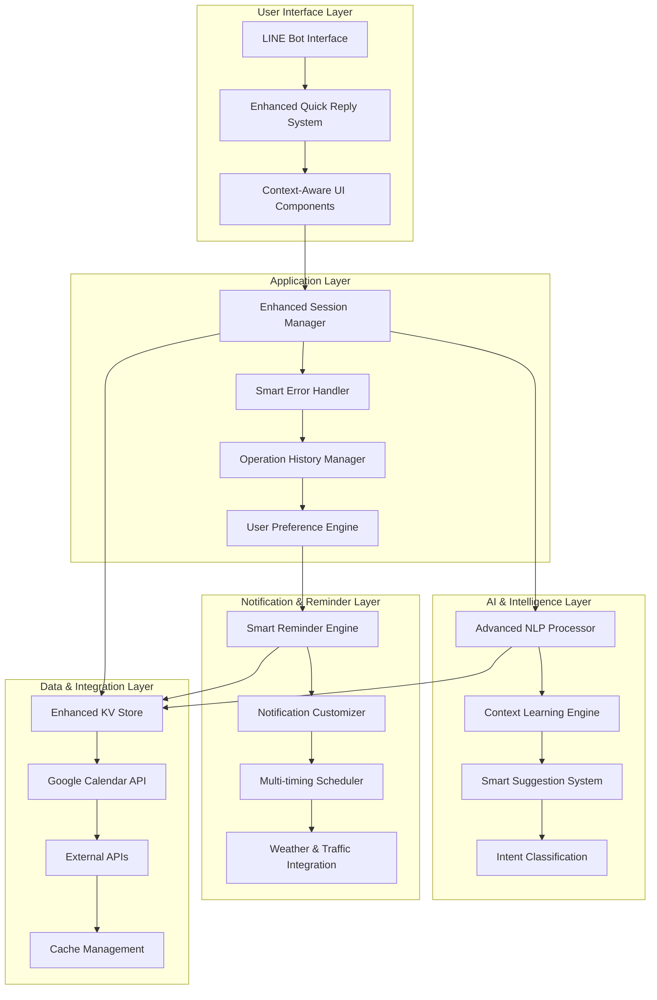

# Design Document

## Overview

このドキュメントは、既存のLINE Bot スケジュール管理システムの大幅な改善のための設計を定義します。現在のアーキテクチャを基盤として、ユーザビリティ、AI機能、通知システムの3つの主要領域での機能強化を実現します。

### Current Architecture Analysis

**既存システムの構成：**
- **フロントエンド**: LINE Bot (Messaging API)
- **バックエンド**: Next.js API Routes
- **データストレージ**: Vercel KV (Redis), Google Calendar API
- **AI処理**: Cloudflare Workers AI
- **主要モジュール**:
  - `schedule-edit.ts`: クイックリプライベースの編集UI
  - `ai-schedule-editor.ts`: AI自然言語処理
  - `session-manager.ts`: ユーザーセッション管理
  - `gcal.ts`: Google Calendar連携
  - `kv.ts`: データ永続化
  - `line.ts`: LINE API連携

## Architecture

### Enhanced System Architecture



### Key Architectural Improvements

1. **Layered Architecture**: 明確な責任分離による保守性向上
2. **Enhanced Session Management**: より堅牢で柔軟なセッション処理
3. **AI Intelligence Layer**: 高度な自然言語理解とコンテキスト学習
4. **Smart Notification System**: カスタマイズ可能で状況認識型の通知
5. **Comprehensive Error Handling**: ユーザーフレンドリーなエラー処理

## Components and Interfaces

### 1. Enhanced User Interface Components

#### 1.1 Smart Quick Reply System
```typescript
interface SmartQuickReplyOptions {
  items: QuickReplyItem[];
  context: UserContext;
  suggestions: AISuggestion[];
  errorRecovery?: ErrorRecoveryOptions;
}

interface UserContext {
  userId: string;
  currentOperation: string;
  operationHistory: OperationHistoryItem[];
  preferences: UserPreferences;
  sessionState: SessionState;
}
```

#### 1.2 Context-Aware UI Components
```typescript
interface ContextAwareComponent {
  adaptToUser(context: UserContext): UIComponent;
  generateSuggestions(history: OperationHistoryItem[]): Suggestion[];
  handleError(error: SystemError): ErrorResponse;
}
```

### 2. Enhanced Session Management

#### 2.1 Advanced Session Manager
```typescript
interface EnhancedSessionManager {
  createSession(userId: string, operation: OperationType): Promise<SessionId>;
  updateSession(sessionId: SessionId, updates: SessionUpdate): Promise<boolean>;
  recoverSession(userId: string): Promise<SessionState | null>;
  cleanupExpiredSessions(): Promise<number>;
  saveOperationCheckpoint(sessionId: SessionId, checkpoint: Checkpoint): Promise<void>;
}

interface SessionState {
  id: string;
  userId: string;
  operation: OperationType;
  step: string;
  data: any;
  checkpoints: Checkpoint[];
  createdAt: number;
  lastActivity: number;
  expiresAt: number;
}
```

#### 2.2 Operation History Manager
```typescript
interface OperationHistoryManager {
  recordOperation(userId: string, operation: Operation): Promise<void>;
  getOperationHistory(userId: string, limit?: number): Promise<Operation[]>;
  undoOperation(userId: string, operationId: string): Promise<UndoResult>;
  bulkUndo(userId: string, timeRange: TimeRange): Promise<BulkUndoResult>;
}

interface Operation {
  id: string;
  userId: string;
  type: OperationType;
  timestamp: number;
  beforeState: any;
  afterState: any;
  reversible: boolean;
}
```

### 3. AI & Intelligence Layer

#### 3.1 Advanced NLP Processor
```typescript
interface AdvancedNLPProcessor {
  processInput(text: string, context: ConversationContext): Promise<NLPResult>;
  extractIntent(text: string): Promise<Intent>;
  extractEntities(text: string): Promise<Entity[]>;
  resolveAmbiguity(text: string, context: ConversationContext): Promise<DisambiguationResult>;
}

interface ConversationContext {
  userId: string;
  recentMessages: Message[];
  currentSchedule: ScheduleContext;
  userPreferences: UserPreferences;
  operationHistory: Operation[];
}

interface NLPResult {
  intent: Intent;
  entities: Entity[];
  confidence: number;
  ambiguities: Ambiguity[];
  suggestions: ProcessingSuggestion[];
}
```

#### 3.2 Context Learning Engine
```typescript
interface ContextLearningEngine {
  learnFromInteraction(userId: string, interaction: Interaction): Promise<void>;
  generatePersonalizedSuggestions(userId: string, context: string): Promise<Suggestion[]>;
  updateUserModel(userId: string, feedback: UserFeedback): Promise<void>;
  getPersonalizationData(userId: string): Promise<PersonalizationData>;
  deleteUserData(userId: string): Promise<void>;
}

interface PersonalizationData {
  frequentLocations: LocationFrequency[];
  timePatterns: TimePattern[];
  eventTypes: EventTypePreference[];
  communicationStyle: CommunicationStyle;
}
```

### 4. Smart Notification & Reminder System

#### 4.1 Smart Reminder Engine
```typescript
interface SmartReminderEngine {
  scheduleSmartReminder(event: CalendarEvent, preferences: NotificationPreferences): Promise<void>;
  calculateOptimalReminderTime(event: CalendarEvent, context: EventContext): Promise<ReminderTime[]>;
  updateRemindersForEvent(eventId: string, changes: EventChanges): Promise<void>;
  cancelRemindersForEvent(eventId: string): Promise<void>;
}

interface EventContext {
  location: LocationInfo;
  weather: WeatherInfo;
  traffic: TrafficInfo;
  userSchedule: ScheduleContext;
  preparationTime: number;
}

interface ReminderTime {
  timing: number; // minutes before event
  type: ReminderType;
  message: string;
  priority: Priority;
}
```

#### 4.2 Notification Customizer
```typescript
interface NotificationCustomizer {
  customizeNotification(template: NotificationTemplate, context: NotificationContext): Promise<CustomNotification>;
  generateNotificationContent(event: CalendarEvent, timing: ReminderTime): Promise<NotificationContent>;
  applyUserPreferences(notification: Notification, preferences: NotificationPreferences): Promise<Notification>;
}

interface NotificationPreferences {
  timings: TimingPreference[];
  contentStyle: ContentStyle;
  priorityRules: PriorityRule[];
  quietHours: TimeRange[];
  eventTypeSettings: EventTypeNotificationSettings[];
}
```

### 5. Enhanced Data Management

#### 5.1 Enhanced KV Store
```typescript
interface EnhancedKVStore {
  // User preferences and learning data
  saveUserPreferences(userId: string, preferences: UserPreferences): Promise<void>;
  getUserPreferences(userId: string): Promise<UserPreferences | null>;
  
  // Operation history
  saveOperation(operation: Operation): Promise<void>;
  getOperationHistory(userId: string, limit: number): Promise<Operation[]>;
  
  // Personalization data
  savePersonalizationData(userId: string, data: PersonalizationData): Promise<void>;
  getPersonalizationData(userId: string): Promise<PersonalizationData | null>;
  
  // Enhanced caching
  setCachedData(key: string, data: any, ttl: number): Promise<void>;
  getCachedData(key: string): Promise<any>;
  invalidateCache(pattern: string): Promise<void>;
}
```

## Data Models

### Enhanced Data Models

#### User Preferences Model
```typescript
interface UserPreferences {
  userId: string;
  language: string;
  timezone: string;
  
  // UI preferences
  preferredInteractionStyle: 'quick_reply' | 'natural_language' | 'mixed';
  showDetailedConfirmations: boolean;
  enableSmartSuggestions: boolean;
  
  // Notification preferences
  notifications: NotificationPreferences;
  
  // AI learning preferences
  enableLearning: boolean;
  dataRetentionDays: number;
  
  // Default values
  defaultEventDuration: number; // minutes
  defaultReminderTime: number; // minutes before
  frequentLocations: string[];
  
  createdAt: number;
  updatedAt: number;
}
```

#### Enhanced Session Model
```typescript
interface EnhancedSession extends SessionState {
  // Error recovery
  lastError?: SystemError;
  errorCount: number;
  recoveryAttempts: number;
  
  // Performance tracking
  responseTime: number[];
  operationComplexity: number;
  
  // Context preservation
  preservedContext: any;
  rollbackPoints: RollbackPoint[];
}
```

#### Smart Reminder Model
```typescript
interface SmartReminder extends ReminderItem {
  // Enhanced properties
  reminderType: ReminderType;
  priority: Priority;
  customMessage?: string;
  
  // Context information
  weatherDependent: boolean;
  trafficDependent: boolean;
  preparationTime?: number;
  
  // Delivery tracking
  deliveryStatus: DeliveryStatus;
  deliveryAttempts: number;
  lastDeliveryAttempt?: number;
  
  // User interaction
  userResponse?: UserResponse;
  snoozeCount: number;
  snoozedUntil?: number;
}
```

## Error Handling

### Comprehensive Error Handling Strategy

#### 1. Error Classification System
```typescript
enum ErrorType {
  USER_INPUT_ERROR = 'user_input_error',
  SYSTEM_ERROR = 'system_error',
  EXTERNAL_API_ERROR = 'external_api_error',
  NETWORK_ERROR = 'network_error',
  AUTHENTICATION_ERROR = 'auth_error',
  RATE_LIMIT_ERROR = 'rate_limit_error',
  DATA_VALIDATION_ERROR = 'validation_error'
}

interface SystemError {
  type: ErrorType;
  code: string;
  message: string;
  userMessage: string;
  suggestions: ErrorSuggestion[];
  recoverable: boolean;
  retryable: boolean;
  context: ErrorContext;
}
```

#### 2. Error Recovery Mechanisms
```typescript
interface ErrorRecoveryManager {
  handleError(error: SystemError, context: OperationContext): Promise<RecoveryResult>;
  suggestRecoveryActions(error: SystemError): Promise<RecoveryAction[]>;
  executeRecovery(action: RecoveryAction, context: OperationContext): Promise<RecoveryResult>;
  rollbackToCheckpoint(sessionId: string, checkpointId: string): Promise<RollbackResult>;
}

interface RecoveryAction {
  type: RecoveryType;
  description: string;
  userFriendlyDescription: string;
  automated: boolean;
  riskLevel: RiskLevel;
  estimatedSuccessRate: number;
}
```

#### 3. User-Friendly Error Messages
```typescript
interface ErrorMessageGenerator {
  generateUserMessage(error: SystemError, context: UserContext): Promise<UserErrorMessage>;
  generateSuggestions(error: SystemError): Promise<ErrorSuggestion[]>;
  generateRecoveryInstructions(error: SystemError): Promise<RecoveryInstruction[]>;
}

interface UserErrorMessage {
  title: string;
  description: string;
  suggestions: string[];
  recoveryOptions: RecoveryOption[];
  contactSupport: boolean;
}
```

## Testing Strategy

### Comprehensive Testing Approach

#### 1. Unit Testing
- **AI Processing Components**: NLP結果の精度テスト
- **Session Management**: セッション状態管理の正確性
- **Error Handling**: エラー処理ロジックの網羅性
- **Notification Logic**: 通知タイミングとコンテンツの正確性

#### 2. Integration Testing
- **Google Calendar API**: API連携の信頼性
- **LINE Messaging API**: メッセージ送受信の正確性
- **KV Store Operations**: データ永続化の整合性
- **External API Integration**: 天気・交通情報APIの連携

#### 3. User Experience Testing
- **Conversation Flow Testing**: 対話フローの自然さ
- **Error Recovery Testing**: エラー時の復旧プロセス
- **Performance Testing**: レスポンス時間の測定
- **Accessibility Testing**: 様々なユーザーニーズへの対応

#### 4. AI Model Testing
- **Intent Classification Accuracy**: 意図理解の精度
- **Entity Extraction Precision**: エンティティ抽出の正確性
- **Context Learning Effectiveness**: 学習機能の効果測定
- **Personalization Quality**: 個人化の品質評価

### Testing Infrastructure

```typescript
interface TestingFramework {
  // Conversation testing
  simulateConversation(scenario: ConversationScenario): Promise<ConversationResult>;
  validateUserExperience(flow: UserFlow): Promise<UXValidationResult>;
  
  // AI testing
  testNLPAccuracy(testCases: NLPTestCase[]): Promise<AccuracyReport>;
  validatePersonalization(userId: string, interactions: Interaction[]): Promise<PersonalizationReport>;
  
  // Performance testing
  measureResponseTime(operation: Operation): Promise<PerformanceMetrics>;
  loadTest(concurrentUsers: number, duration: number): Promise<LoadTestResult>;
  
  // Error testing
  simulateErrors(errorScenarios: ErrorScenario[]): Promise<ErrorHandlingReport>;
  validateRecovery(recoveryScenarios: RecoveryScenario[]): Promise<RecoveryReport>;
}
```

## Performance Considerations

### Optimization Strategies

#### 1. Response Time Optimization
- **Caching Strategy**: 頻繁にアクセスされるデータのキャッシュ
- **Async Processing**: 重い処理の非同期化
- **Connection Pooling**: データベース接続の効率化
- **CDN Integration**: 静的リソースの配信最適化

#### 2. AI Processing Optimization
- **Model Caching**: AI モデルの結果キャッシュ
- **Batch Processing**: 複数リクエストの一括処理
- **Fallback Mechanisms**: AI処理失敗時の代替処理
- **Progressive Enhancement**: 段階的な機能提供

#### 3. Memory Management
- **Session Cleanup**: 期限切れセッションの自動削除
- **Data Pruning**: 古いデータの定期削除
- **Memory Monitoring**: メモリ使用量の監視
- **Garbage Collection**: 効率的なメモリ解放

#### 4. Scalability Design
- **Horizontal Scaling**: 負荷分散対応
- **Database Sharding**: データベースの分散
- **Queue Management**: 処理キューの管理
- **Rate Limiting**: API使用量の制御

## Security and Privacy

### Security Measures

#### 1. Data Protection
- **Encryption at Rest**: 保存データの暗号化
- **Encryption in Transit**: 通信データの暗号化
- **Access Control**: 適切なアクセス権限管理
- **Data Anonymization**: 個人情報の匿名化

#### 2. Privacy Compliance
- **GDPR Compliance**: EU一般データ保護規則への対応
- **Data Retention Policy**: データ保持期間の管理
- **User Consent Management**: ユーザー同意の管理
- **Data Deletion Rights**: データ削除権の実装

#### 3. Authentication & Authorization
- **Secure Session Management**: セッションの安全な管理
- **API Key Protection**: APIキーの安全な保護
- **Rate Limiting**: 不正アクセスの防止
- **Audit Logging**: セキュリティ監査ログ

### Privacy-First Design

```typescript
interface PrivacyManager {
  // Consent management
  recordConsent(userId: string, consentType: ConsentType): Promise<void>;
  checkConsent(userId: string, operation: Operation): Promise<boolean>;
  revokeConsent(userId: string, consentType: ConsentType): Promise<void>;
  
  // Data management
  anonymizeUserData(userId: string): Promise<void>;
  deleteUserData(userId: string): Promise<DeletionReport>;
  exportUserData(userId: string): Promise<DataExport>;
  
  // Compliance
  generatePrivacyReport(userId: string): Promise<PrivacyReport>;
  validateCompliance(operation: Operation): Promise<ComplianceResult>;
}
```

## Migration Strategy

### Phased Implementation Approach

#### Phase 1: Foundation Enhancement (Weeks 1-2)
- Enhanced error handling implementation
- Improved session management
- Basic user preferences system
- Operation history tracking

#### Phase 2: AI Intelligence Layer (Weeks 3-4)
- Advanced NLP processor implementation
- Context learning engine development
- Smart suggestion system
- Intent classification improvement

#### Phase 3: Smart Notifications (Weeks 5-6)
- Smart reminder engine implementation
- Notification customization system
- Multi-timing scheduler
- External API integration (weather, traffic)

#### Phase 4: User Experience Polish (Weeks 7-8)
- UI/UX improvements
- Performance optimization
- Comprehensive testing
- Documentation and training

### Backward Compatibility

```typescript
interface MigrationManager {
  migrateUserData(userId: string, fromVersion: string, toVersion: string): Promise<MigrationResult>;
  validateMigration(userId: string): Promise<ValidationResult>;
  rollbackMigration(userId: string, toVersion: string): Promise<RollbackResult>;
  generateMigrationReport(): Promise<MigrationReport>;
}
```

この設計により、既存システムの強固な基盤を活用しながら、ユーザビリティ、AI機能、通知システムの大幅な改善を実現します。段階的な実装アプローチにより、リスクを最小化しながら確実な機能向上を図ります。