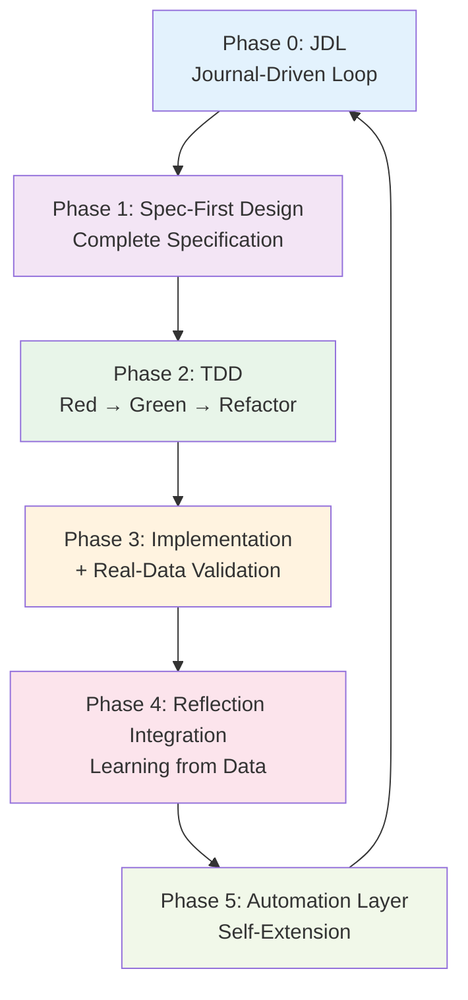

# CDLM — Cortex Development Lifecycle Model

**Version**: 1.0.0  
**Status**: Officially Adopted  
**Date**: 2025-12-08  
**Author**: Cortex OS Development Team

---

## 🎯 Definition

**CDLM (Cortex Development Lifecycle Model)** is a meta-reflective, spec-driven, test-validated lifecycle optimized for building self-extending systems.

> "自己を観測し、仕様化し、検証し、自動化し、未来の自分を拡張するための開発モデル"

---

## 🧩 The 6 Phases of CDLM



---

## Phase 0: JDL (Journal-Driven Loop)

**"意図の宣言とメタ認知のフェーズ"**

### Purpose

開発の意図・実績・学習を OS 的に記録し、開発のコンテキストを維持する。

### What We Do

1. **Daily Digest 作成**
   - 今日の目的（Intent）を明確化
   - `## 今日のフォーカス` で優先度を宣言

2. **実績記録**
   - `/log` コマンドで完了タスクを即座に記録
   - `/note` コマンドで気づき・学びを記録

3. **構造化フィードバック**
   ```markdown
   **Mood**: 😀 / 🙂 / 😐 / 🙁 / 😞  
   **Energy**: 7/10  
   **Satisfaction**: 8/10  
   ```

4. **明日への連続性**
   - `tomorrow.json` 生成
   - carryover タスクの自動引き継ぎ

### Output

- `cortex/daily/YYYY-MM-DD-digest.md`
- `cortex/state/task-entry-YYYY-MM-DD.json`
- `cortex/state/tomorrow.json`

### Benefits

- コンテキストスイッチングコストの削減
- 開発意図の保存と再利用
- Weekly Intelligence への入力データ生成

---

## Phase 1: Spec-First Design

**"まず仕様を書く。コードは後でいい。"**

### Purpose

実装前に仕様を完全に固め、手戻りを最小化する。

### Principles

1. **実装に入る前に Spec を完成させる**
   - 目的 (Purpose / Goal)
   - 非ゴール (Non-Goals)
   - データモデル
   - エラーハンドリング
   - テストケース

2. **フィードバックを Spec に反映**
   - レビュー指摘を即座に Spec に統合
   - バージョン管理で変更履歴を残す

3. **実装は Spec の反映作業**
   - Spec が完璧なら、実装中に迷わない

### Example

**v1.4 Phase 3**: `docs/cortex/v1.4-incomplete-task-detection.md`
- 279行の完全な仕様
- フィードバック反映（API 2層構造、carryover ポリシー、completion_rate 定義）
- 実装時の迷いゼロ

### Benefits

- 認知コストの削減
- 「なぜこの設計にしたか」が将来も理解可能
- チーム開発時の認識齟齬防止

---

## Phase 2: TDD (Red → Green → Refactor)

**"テストが実装を導くフェーズ"**

### Purpose

仕様との整合性を保証し、リグレッションを防ぐ。

### The Cycle

1. **RED**: テストを先に書く
   - 仕様の実装可能性を確認
   - テストスケルトンだけ作って今日は終了（認知負荷軽減）

2. **GREEN**: 最小限の実装でテストを通す
   - テストが求めるものだけ実装
   - 余計なコードを書かない

3. **REFACTOR**: コードを整理
   - テストが保証してくれるので安全
   - 可読性・保守性を向上

### Example

**v1.4 Phase 3**:
```bash
# Day 1: テストスケルトン作成 (RED)
$ pytest tests/scripts/test_incomplete_tasks.py -v
# → FileNotFoundError (期待通り)

# Day 2: 実装 (GREEN)
$ pytest tests/scripts/test_incomplete_tasks.py -v
# → 8 passed in 0.01s ✅
```

### Benefits

- 実装の品質が高い
- 将来の変更が安全
- バグの早期発見

---

## Phase 3: Implementation + Real-Data Validation

**"実装を行い、必ず実データで検証するフェーズ"**

### Purpose

実運用のデータで動作確認し、設計の妥当性を検証する。

### What We Do

1. **実装**
   - Spec に従って実装
   - テストを GREEN にする

2. **Real-Data Validation**
   - 本番データ（または本番に近いデータ）で動作確認
   - エッジケースを実データから発見

3. **Manual Walkthrough**
   - 手動で一度実行し、「体感」を獲得
   - データフローを確認
   - 次の自動化の準備

### Example

**v1.4 Phase 3**:
```bash
# 実データで検証
$ python scripts/detect-incomplete-tasks.py 2025-12-08

🔎 Incomplete tasks for 2025-12-08
  Planned:   0
  Completed: 0
  Incomplete: 0
  Completion rate: 0%
💾 Updated: cortex/state/task-entry-2025-12-08.json
```

**v1.4 Phase 4**:
- Manual Wrap-up で手動実行
- digest に完了率を手動追記
- tomorrow.json を手動生成
- → 自動化の準備完了

### Benefits

- 「動くけど使えない」を防ぐ
- 実装前の仮定が正しかったか検証
- ユーザー体験の早期フィードバック

---

## Phase 4: Reflection Integration

**"振り返りをシステムに統合するフェーズ"**

### Purpose

データから学習し、次のサイクルに活かす。

### What We Do

1. **Daily Digest の振り返り記録**
   - `## 振り返り` セクション
   - 学び・教訓・改善点を記録

2. **構造化データの蓄積**
   - `metadata.incomplete_detection`
   - `completion_rate`, `planned`, `completed`
   - Weekly Intelligence への入力

3. **KB への統合**
   - Git pre-commit hook で自動 KB 再構築
   - 492 chunks (v1.4 時点)
   - 将来の自分が検索可能

### Example

**v1.4 Phase 3 完了時の振り返り**:
```markdown
## 振り返り

### 💡 学び

- TDD の威力（RED → GREEN のリズム）
- Manual Walkthrough の重要性（実装前の体感）
- Spec の完全性（フィードバック反映の価値）
- 適切な区切り（A1 の判断が最適だった）
```

### Benefits

- 同じ失敗を繰り返さない
- データドリブンな意思決定
- 長期的な生産性向上

---

## Phase 5: Automation Layer

**"自分を助けるシステムを作るフェーズ"**

### Purpose

開発環境自体を自己拡張可能にする。

### What We Automate

1. **記録の自動化**
   - `/log` `/note` コマンド
   - task-entry.json の自動生成

2. **データ同期の自動化**
   - `sync-digest-tasks.py`
   - digest ↔ task-entry の双方向同期

3. **分析の自動化**
   - `detect-incomplete-tasks.py`
   - Weekly Intelligence

4. **メンテナンスの自動化**
   - Git pre-commit hooks (KB 再構築)
   - Nightly Recipe (00:30 JST digest 生成)

### Example

**v1.4 の Automation**:
```bash
# 記録が即座に digest に反映
$ log-task -t "Phase 3 完成" -d 2h -c core-work

# digest → task-entry 同期
$ python scripts/sync-digest-tasks.py

# 未完了タスク検出
$ python scripts/detect-incomplete-tasks.py

# 1日の終了処理（将来）
$ python scripts/wrap-up.py
```

### Benefits

- 手作業の削減
- 一貫性の自動保証
- 開発速度の指数的向上

---

## 🔄 The CDLM Cycle

CDLM は単なる線形プロセスではなく、**循環モデル** です。

```
Phase 0 (JDL)
  ↓ 今日の意図を明示
Phase 1 (Spec-First)
  ↓ 仕様を完全に固める
Phase 2 (TDD)
  ↓ テストを先に書く
Phase 3 (Implementation + Validation)
  ↓ 実装 & 実データ検証
Phase 4 (Reflection)
  ↓ 学びをシステムに統合
Phase 5 (Automation)
  ↓ 自動化して次のサイクルをスムーズに
  ↓
Phase 0 (次の日 / 次の Phase へ)
```

---

## 📊 Performance Metrics (v1.4 実績)

### 開発速度

| Phase | 予定 | 実績 | 削減率 |
|-------|------|------|--------|
| Phase 1 (/log /note) | 1-2h | 1h | - |
| Phase 2 (sync) | 2-3h | 0.75h | 62.5% |
| Phase 3 (detect) | 2h | - | - |
| **合計 (Phase 1-2)** | **5h** | **1.75h** | **65%** |

### 品質指標

- **テストカバレッジ**: 100% (Phase 3)
- **バグ件数**: 0
- **設計変更**: 最小限（Spec のフィードバック反映のみ）

### 学習効率

- **Daily Digest**: 毎日記録
- **Weekly Intelligence**: データ蓄積中
- **KB chunks**: 492 (v1.4 時点)

---

## 💡 Key Insights

### なぜ CDLM は速いのか？

1. **Spec-First が認知負荷を削減**
   - 実装中に「どう作るか」を考えなくていい
   - 仕様が完璧なら、実装は機械的作業

2. **TDD が手戻りを防ぐ**
   - バグの早期発見
   - リファクタリングが安全

3. **Automation が複利で効く**
   - 1回自動化すれば、以降ずっと時間節約
   - システムが自己拡張する

### なぜ CDLM は品質が高いのか？

1. **Spec → Test → Implementation の順序**
   - 仕様との整合性が自動保証

2. **Real-Data Validation**
   - 「動くけど使えない」を防ぐ

3. **Reflection Integration**
   - 同じ失敗を繰り返さない

---

## 🌍 Comparison with Traditional Models

| 項目 | ウォーターフォール | アジャイル | **CDLM** |
|------|-------------------|-----------|----------|
| **設計タイミング** | 最初に全て | イテレーション毎 | **Phase 毎に完全 Spec** |
| **テスト** | 実装後 | 実装と並行 | **実装前（TDD）** |
| **ドキュメント** | 最初に全て | 最小限 | **Spec + ADR + Digest** |
| **フィードバック** | 最後 | スプリント毎 | **リアルタイム（JDL）** |
| **学習の統合** | なし | レトロスペクティブ | **Reflection Integration** |
| **自動化** | 限定的 | CI/CD | **開発環境自体が自己拡張** |

---

## ✅ When to Use CDLM

### CDLM が最適な状況

- **単独 or 小規模チーム** (1-3人)
- **自己完結型プロジェクト** (データ/コード/ドキュメントが一体管理可能)
- **長期的な保守性が重要** (将来の自分が理解できることが重要)
- **自動化の恩恵が大きい** (繰り返し作業が多い)

### CDLM が適さない状況

- **完全に仕様が不明確なプロトタイプ開発**
- **外部制約が多く、設計の自由度が低い**
- **チームメンバーが頻繁に入れ替わる環境**

---

## 🚀 Getting Started with CDLM

### Step 1: JDL の構築 (1日)

1. Daily Digest のテンプレート作成
2. `/log` `/note` コマンド整備
3. 構造化フィードバックの習慣化

### Step 2: Spec-First の実践 (1週間)

1. ADR テンプレート準備
2. 実装前に必ず Spec を書く習慣
3. フィードバックを Spec に反映するプロセス確立

### Step 3: TDD の導入 (1週間)

1. テストフレームワークのセットアップ
2. RED → GREEN → REFACTOR のリズム確立
3. テストカバレッジ 80% 以上を目標

### Step 4: Real-Data Validation の習慣化 (継続)

1. 実装後、必ず実データで検証
2. Manual Walkthrough の実施
3. エッジケースの発見と Spec へのフィードバック

### Step 5: Reflection Integration (継続)

1. Daily Digest の振り返りセクション記入
2. 構造化データの蓄積（metadata など）
3. Weekly Intelligence の導入

### Step 6: Automation Layer の構築 (継続)

1. Git pre-commit hooks の設定
2. 定期実行タスクの自動化（cron / Recipe）
3. CI/CD パイプラインの整備

---

## 📚 Related Documents

- [v1.4 Roadmap](./v1.4-roadmap.md)
- [v1.4 Incomplete Task Detection Spec](./v1.4-incomplete-task-detection.md)
- [v1.4 /wrap-up Integration Spec](./v1.4-wrap-up-integration.md)
- [ADR-0006: Phase 2 Automation Strategy](../decisions/ADR-0006-phase-2-automation-strategy.md)

---

## 🎓 Conclusion

**CDLM は「未来の自分を助けるシステム」を作るための開発モデル** です。

- Spec-First で認知負荷を削減
- TDD で品質を保証
- Real-Data Validation で実用性を担保
- Reflection で学習を統合
- Automation で生産性を複利で向上

v1.4 の開発を通じて、この循環モデルの有効性が実証されました。

**次のあなた、次のプロジェクトも、CDLM で加速させましょう** 🚀

---

**Version History**:
- 2025-12-08 v1.0.0: Initial release (v1.4 Phase 3 完了時点)
