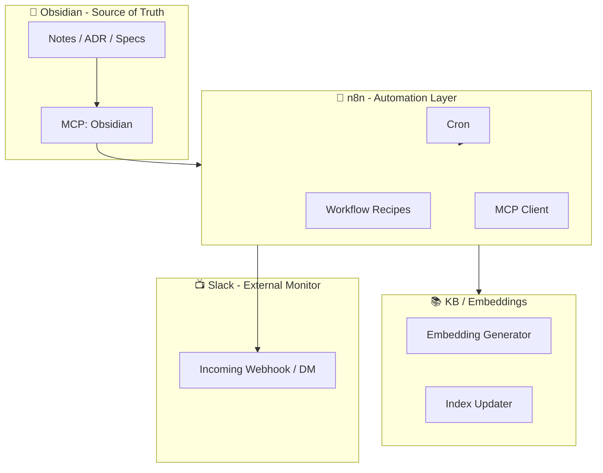

# ADR-0006: Phase 2 Automation Strategy
Status: Accepted
Date: 2025-11-17
Author: dauberside

---

## 🎯 Context

v1.0.0 "Knowledge Base Foundation" では、
DX・信頼性・アーキテクチャ・ドキュメント・自動化基盤の土台が整備された。

しかし、現時点では **自動化（Automation）そのものは最小限**であり、
以下のような "第二の脳らしい振る舞い" はまだ実装されていない：

- Obsidian のノート更新通知
- 定期 KB 再構築
- タスク抽出
- ADR ワークフローの自動化
- 週次ふりかえり
- Healthz ベースの自己監視
- Slack DM / Slack チャンネル通知
- GitHub Issue / PR 自動管理

Phase 2 の目的は、
**「自動で動く Knowledge System」** を実現することにある。

---

## 🧩 Decision

Phase 2 Automation Strategy として以下を採択する。

### 1. 自動化の中心は **n8n** とする
- すでに Docker Compose + MCP Server による統合基盤が整っている
- Low-code かつ JSON エクスポート可能で、ドキュメント化しやすい
- 「第二の脳の神経系」として最適

### 2. "イベント駆動" と "定期処理" を組み合わせる
- イベント駆動：Obsidian / GitHub / MCP
- 定期処理：Cron ワークフロー（再インデックス、週次集計、健康診断）

### 3. Slack は **通知の集約ポイント** として活用
- Slack をタスク管理の中心にはしない（哲学上 NG）
- "外界への可視化機構（External Monitor）" として利用

### 4. Obsidian は正本（Source of Truth）のまま維持
- 自動化は Obsidian を破壊しない
- Read-only（差分抽出）を優先し、Write は慎重に扱う

### 5. KB（RAG）の最新性を自動で維持
- 定期 ingest → embedding → index 更新
- Delta ingest を中心に据える

### 6. MCP は "外界との橋渡し" の役割を維持
- n8n の MCP Client から呼び出す
- Obsidian MCP / GitHub MCP / Calendar MCP / n8n MCP の 4系統

### 7. レシピ方式で段階的に実装
Phase 2 では以下の 8 レシピを中心に展開する：

| # | レシピ名 | 種類 | 状態 |
|---|---------|------|------|
| 1 | Obsidian → Slack 通知 | Event | ✅ |
| 2 | 定期 KB 再構築 | Cron | ✅ |
| 3 | Daily Note → Slack DM | Productivity | - |
| 4 | ADR 追加 → GitHub Issue 自動作成 | Project | - |
| 5 | PR マージ → KB 更新 | DevOps | - |
| 6 | Build/Deploy → アラート | Monitoring | - |
| 7 | 週次ふりかえりノート生成 | Report | ✅ |
| 8 | Healthz 監視 → 自動復旧フロー | Reliability | - |
| 9 | Daily Digest → Claude Code 連携 | Cron | ✅ |
| 10 | Daily Digest → TODO.md Auto-sync | Cron | ✅ |
| 11 | Weekly Summary (Cortex OS) | Cron | ✅ |
| 12 | wrap-up → brief データブリッジ | Command | ✅ |

---

## 🏗️ Architecture

---

## 🧪 Consequences

### Positive
- 第二の脳が "勝手に動く" 仕組みが実現
- Obsidian を中心とした一貫した UX
- Slack により「気づきの速さ」が向上
- n8n による透明性の高いワークフロー
- RAG（KB）が常に新鮮な状態で保たれる

### Neutral
- n8n のランタイムを常時稼働させる必要がある
- MCP 統合が進むほど依存関係は複雑になる

### Negative
- 自動化の誤爆（誤通知・誤 ingest）のリスク
- セキュリティ面での Webhook / Token 管理が重要になる
- ワークフローの増加によるメンテナンスコスト

---

## 🚀 Implementation Plan

Phase 2 実装は 3 段階で行う。

### Phase 2.1 — 基本自動化（Core Automation）
- Recipe 1: Obsidian → Slack 通知
- Recipe 2: 定期 KB 再構築
- Recipe 3: Daily Note 集計 → Slack DM

### Phase 2.2 — 推論系とプロジェクト連携
- Recipe 4: ADR → GitHub Issue
- Recipe 5: PR → KB 更新
- Recipe 7: 週次ふりかえりノート生成

### Phase 2.3 — 監視と自己修復
- Recipe 6: CI/CD アラート
- Recipe 8: Healthz 自動復旧

---

## 📝 Status

This ADR is **Accepted** (2025-11-19).

### Implementation Notes

**Phase 2.1 完了（2025-11-19）**:
- ✅ Recipe 1: Obsidian → Slack 通知
- ✅ Recipe 2: 定期 KB 再構築
- ✅ Recipe 7: 週次ふりかえりノート生成
- ✅ Recipe 9: Daily Digest → Claude Code 連携
- ✅ Recipe 10: Daily Digest → TODO.md Auto-sync
- ✅ Recipe 11: Weekly Summary (Cortex OS)
- ✅ Recipe 12: wrap-up → brief データブリッジ

**Key Learnings**:
- n8n HTTP Request v4.2 では raw body 送信時に `contentType: "raw"` + `rawContentType: "text/markdown"` の設定が必要
- Obsidian Local REST API への認証は httpHeaderAuth credentials を使用
- Aggregate ノードを通過すると日付情報が失われるため、Merge ノードで保持が必要

---

## 🔗 Related Documents

- [MCP Recipes](../operations/mcp-recipes.md) - Recipe 詳細仕様
- [Phase 2 Implementation Guide](../operations/phase-2-implementation.md) - 実装手順
- [ADR-0003: MCP Integration Architecture](./ADR-0003-mcp-integration-architecture.md)
- [ADR-0004: Obsidian Dual Layer Integration](./ADR-0004-obsidian-dual-layer-integration.md)
- [ADR-0005: KB Embedding Mode Selection](./ADR-0005-kb-embedding-mode-selection.md)

---

**Phase 2: 自動で動く Knowledge System へ** 🚀
