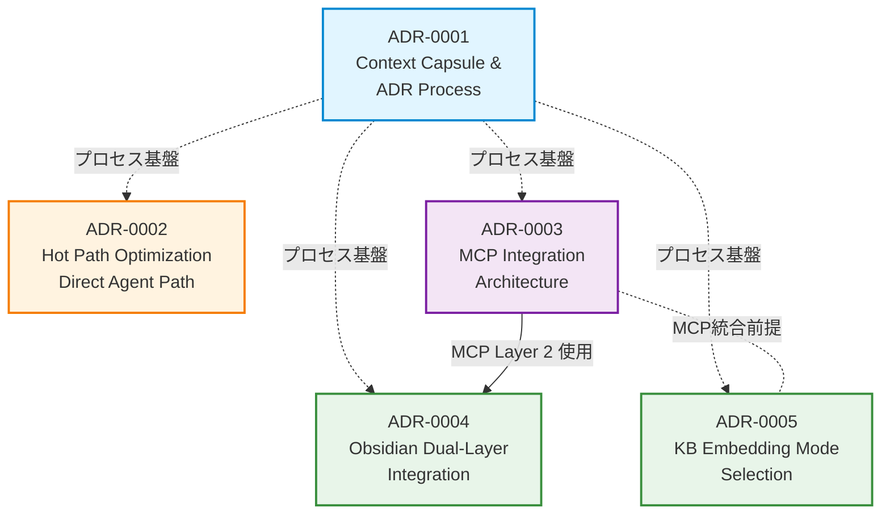

# Architecture Decision Records (ADR) Index

このディレクトリには、プロジェクトのアーキテクチャ上の重要な決定を記録した ADR (Architecture Decision Record) が格納されています。

---

## 📚 ADR とは

**ADR (Architecture Decision Record)** は、アーキテクチャに影響を与える重要な決定を構造化して記録するドキュメントです。

**標準構成**:
- **背景 (Context)**: なぜこの決定が必要だったのか
- **決定 (Decision)**: 何を選択したのか
- **根拠 (Rationale)**: なぜその選択をしたのか
- **影響 (Consequences)**: この決定によって何が変わるのか

**メリット**:
- 将来の開発者が「なぜそうなっているか」を理解できる
- 設計判断の透明性が高まる
- 同じ議論を繰り返さずに済む

---

## 🗺️ ADR 関係図



**凡例**:
- 🔵 **プロセス基盤** (ADR-0001): 全ADRの基礎
- 🟠 **独立系** (ADR-0002): 特定機能の最適化
- 🟣 **統合基盤** (ADR-0003): 他ADRが依存する基盤
- 🟢 **派生系** (ADR-0004, 0005): 基盤ADRに依存

**依存関係の読み方**:
- **実線矢印** (→): 直接的な依存（例: 0004は0003のMCP統合を使用）
- **点線矢印** (-.->): 間接的な依存または前提（例: 0005はMCP統合を前提とするが必須ではない）

---

## 📋 ADR 一覧

### ADR-0001: Context Capsule and ADR Process

**ステータス**: ✅ Accepted
**日付**: 2025-11-16
**カテゴリ**: Process / Documentation

**概要**:
- Context Capsule（携行用要約）の導入
- ADR プロセスの確立
- ドキュメント駆動開発の基盤

**影響**:
- 全ADRはこのプロセスに従う
- 会話継続時の文脈維持が改善
- 設計判断の可視化

**リンク**: [ADR-0001 本文](./ADR-0001-context-capsule-and-adr-process.md)

---

### ADR-0002: Hot Path Optimization (Direct Agent Path)

**ステータス**: ✅ Accepted
**日付**: 2025-11-09
**カテゴリ**: Performance / Architecture

**概要**:
- `/api/agent/direct` エンドポイント追加
- インプロセス実行による低レイテンシー化
- ワークフロー経由との使い分け

**影響**:
- チャット操作が高速化
- KB検索統合が容易に
- 2つの実行パスの保守が必要

**依存**:
- なし（独立系）

**リンク**: [ADR-0002 本文](./ADR-0002-hot-path-optimization.md)

---

### ADR-0003: MCP Integration Architecture

**ステータス**: ✅ Accepted
**日付**: 2025-11-16
**カテゴリ**: Integration / MCP

**概要**:
- 4つのMCPサーバー統合（Obsidian, GitHub, Google Calendar, n8n）
- `.mcp.json` (チーム共有) + `.mcp.local.json` (個人設定) の二層構成
- Knowledge Base との統合フロー

**影響**:
- 外部サービスとの統合が標準化
- LLMクライアントからツールアクセス可能
- 開発者は個人用設定で自由にカスタマイズ

**依存**:
- ADR-0001 (プロセス基盤)

**リンク**: [ADR-0003 本文](./ADR-0003-mcp-integration-architecture.md)

---

### ADR-0004: Obsidian Dual-Layer Integration

**ステータス**: ✅ Accepted
**日付**: 2025-11-16
**カテゴリ**: Integration / Obsidian / MCP

**概要**:
- **Layer 1 (REST API)**: KB取り込み専用（読み取りのみ、ポート8443）
- **Layer 2 (MCP)**: ノート編集・管理（読み書き、ファイルI/O）
- Delta検出（SHA256ハッシュ）による差分更新

**影響**:
- Obsidian Vaultに対する明確なアクセス方式
- KB取り込みと編集操作の責務分離
- 安全なノート編集フロー

**依存**:
- ADR-0003 (MCP統合基盤) - Layer 2でMCP使用

**リンク**: [ADR-0004 本文](./ADR-0004-obsidian-dual-layer-integration.md)

---

### ADR-0005: KB Embedding Mode Selection

**ステータス**: ✅ Accepted
**日付**: 2025-11-16
**カテゴリ**: Knowledge Base / Performance

**概要**:
- **OpenAI モード**（本番）: `text-embedding-3-small`、高精度セマンティック検索
- **Hash モード**（開発）: SHA256ベース決定的埋め込み、API不要、完全一致のみ
- Delta検出による増分ビルド

**影響**:
- 開発環境でのコスト削減（Hash モード）
- 本番環境で高精度検索（OpenAI モード）
- 環境変数で切り替え可能

**依存**:
- ADR-0003 (MCP統合) - 間接的（Obsidian Vault取り込み）

**リンク**: [ADR-0005 本文](./ADR-0005-kb-embedding-mode-selection.md)

---

## 🔄 ADR 更新・追加フロー

### 新規 ADR 作成

1. **テンプレート使用**:
   ```bash
   cp docs/decisions/ADR-template.md docs/decisions/ADR-XXXX-title.md
   ```

2. **必須セクション記入**:
   - 背景（Context）
   - 決定（Decision）
   - 根拠（Rationale）
   - 影響（Consequences）

3. **このインデックスに追記**:
   - ADR一覧に新しいADRを追加
   - 関係図（Mermaid）に依存関係を反映

4. **レビュー＆マージ**:
   - PRを作成してチームレビュー
   - マージ後は不変（修正はAddendumまたは新規ADRで）

### 既存 ADR 修正

**原則**: ADRは一度Acceptedになったら基本的に不変

**例外的に修正が必要な場合**:
- 誤字・脱字
- リンク切れ
- 明らかな事実誤認

**大きな変更が必要な場合**:
- 既存ADRに「Addendum」セクションを追加
- または新規ADRを作成して旧ADRを「Superseded」とマーク

---

## 📖 関連ドキュメント

- [Getting Started](../operations/getting-started.md) - 開発者向けオンボーディング
- [MCP Setup Guide](../operations/mcp-setup-guide.md) - MCP初期設定
- [KB Setup](../operations/kb-setup.md) - Knowledge Base構築手順
- [CLAUDE.md](../../CLAUDE.md) - Claude Code向けガイド

---

## 📞 質問・フィードバック

ADRに関する質問やフィードバックは [GitHub Issues](https://github.com/dauberside/dauberside.github.io/issues) にお願いします。

---

**最終更新**: 2025-11-17
