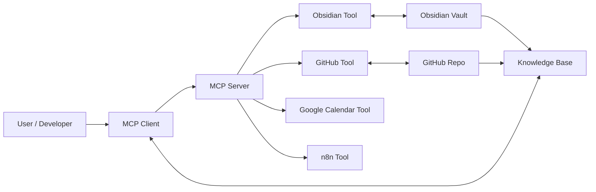

# Getting Started：プロジェクト Onboarding ガイド

このプロジェクトへようこそ！このガイドでは、開発環境のセットアップから基本的なワークフローまでを順を追って説明します。

---

## 📖 プロジェクト概要

このプロジェクトは、**AI エージェント** と **ナレッジベース (KB)** を中心とした統合システムです：

- **Next.js 14** (Pages Router) + React 18 + TypeScript 5.8
- **OpenAI Agents SDK** + Claude 統合
- **Knowledge Base (RAG)**: ドキュメント埋め込み検索
- **MCP (Model Context Protocol)**: Obsidian, GitHub, Vercel, n8n 統合
- **LINE Messaging API**: チャットボット
- **Google Calendar**: スケジュール管理

**主要な機能**:
- AI エージェントによる自然言語対話
- ナレッジベース検索（Semantic Search / RAG）
- スケジュール管理（作成・編集・削除）
- 多サービス連携（MCP 経由）

---

## 🛠️ Prerequisites（前提条件）

### 必須ツール

| ツール | バージョン | 用途 |
|--------|-----------|------|
| **Node.js** | 22.x | ランタイム |
| **pnpm** | 9.x | パッケージマネージャー |
| **Git** | 最新 | バージョン管理 |

### 推奨ツール（オプション）

| ツール | 用途 |
|--------|------|
| **uvx** | MCP サーバー起動（Python ツール） |
| **Obsidian** | ノート管理（MCP 統合用） |
| **Docker** | PM2 / n8n 実行環境 |
| **Tailscale** | VPN アクセス |

### 環境変数

最低限必要な環境変数：
```bash
# .env.local を作成
OPENAI_API_KEY=sk-...                    # OpenAI API（必須）
KB_SOURCES=docs                          # KB ソースディレクトリ（任意）
```

---

## ⚡ Quick Start（5分セットアップ）

### 1. リポジトリクローン

```bash
git clone https://github.com/dauberside/dauberside.github.io.git
cd dauberside.github.io-1
```

### 2. 依存関係インストール

```bash
pnpm install
```

### 3. 環境変数設定

```bash
# .env.local を作成
cp .env.example .env.local

# 最低限の設定
OPENAI_API_KEY=sk-your_key_here
```

### 4. KB インデックス構築

```bash
# ドキュメントを埋め込みインデックス化
pnpm kb:build
```

### 5. 開発サーバー起動

```bash
# 通常の起動
pnpm dev

# または、KB 再構築付き起動
pnpm dev:kb

# または、MCP ガイド付き起動
pnpm dev:mcp
```

### 6. 動作確認

```bash
# 別ターミナルで
curl http://localhost:3000/api/healthz

# レスポンス例
# {
#   "ok": true,
#   "uptime": 123.45,
#   "checks": {
#     "kb": { "status": "healthy", ... },
#     "obsidian": { "status": "not_configured", ... }
#   }
# }
```

---

## 🏗️ Architecture Overview（全体アーキテクチャ）

### 1. MCP 統合アーキテクチャ

4つの MCP サーバーと Knowledge Base が統合されています：



**詳細**: [MCP セットアップガイド](./mcp-setup-guide.md) | [MCP 統合アーキテクチャ図](./mcp-setup-guide.md#アーキテクチャ概要mcp-統合全体図adr-0003-対応)

### 2. Obsidian 二層統合

**Layer 1 (REST API)**: KB 取り込み専用（読み取りのみ）
**Layer 2 (MCP)**: ノート編集・管理（読み書き）

**詳細**: [ADR-0004: Obsidian 二層統合](../decisions/ADR-0004-obsidian-dual-layer-integration.md) | [MCP-Obsidian 統合仕様](./mcp-obsidian-spec.md)

### 3. KB 埋め込みフロー

**パイプライン**:
```
ソース監視 → パーサー → チャンク分割 → Embedding 生成 → Index 反映
```

**詳細**: [KB セットアップガイド](./kb-setup.md#パイプライン概要kb-埋め込みフローadr-0005-対応)

---

## 🔑 Key Concepts（重要概念）

### Knowledge Base (KB)

**何をするもの？**
- ドキュメント（Markdown）を埋め込みベクトル化
- セマンティック検索（意味検索）
- RAG（Retrieval-Augmented Generation）によるコンテキスト注入

**ファイル構造**:
```
kb/
  index/
    embeddings.json  # 埋め込みインデックス（Git 管理対象）
```

**操作**:
```bash
pnpm kb:build           # 全ファイル再インデックス
pnpm kb:smoke:next      # 検索テスト
```

**詳細**: [KB セットアップガイド](./kb-setup.md)

### MCP (Model Context Protocol)

**何をするもの？**
- AI アシスタント（Claude, GPT など）が外部サービスにアクセスするための標準プロトコル
- ツール（Obsidian, GitHub, Vercel, n8n）をプラグイン形式で統合

**設定ファイル**:
- `.mcp.json` - チーム共有設定（Git 管理）
- `.mcp.local.json` - 個人用設定（API キー、Git 除外）

**詳細**: [MCP セットアップガイド](./mcp-setup-guide.md) | [MCP ローカル開発ガイド](./mcp-local-dev.md)

### ADR (Architecture Decision Record)

**何をするもの？**
- アーキテクチャ上の重要な決定を記録
- 背景・決定・根拠・影響を構造化

**主要 ADR**:
- [ADR-0003: MCP 統合アーキテクチャ](../decisions/ADR-0003-mcp-integration-architecture.md)
- [ADR-0004: Obsidian 二層統合](../decisions/ADR-0004-obsidian-dual-layer-integration.md)
- [ADR-0005: KB 埋め込みモード選択](../decisions/ADR-0005-kb-embedding-mode-selection.md)

### Agent Builder System

**何をするもの？**
- JSON 設定から TypeScript コード生成
- エージェントのツール定義を自動化

**設定場所**: `src/lib/agent/configs/{name}.json`
**生成ファイル**: `src/lib/agent/agent.generated.ts`（編集禁止）

**操作**:
```bash
pnpm agent:builder:validate    # 設定検証
pnpm agent:builder:generate    # コード生成
pnpm agent:builder:smoke       # E2E テスト
```

**詳細**: [CLAUDE.md - Agent Builder System](../../CLAUDE.md#1-agent-builder-system-code-generation)

---

## 🔄 Development Workflows（開発ワークフロー）

### パターン 1: ドキュメント編集 → KB 更新

```bash
# 1. ドキュメント編集（docs/*.md）
vim docs/requirements/chat.md

# 2. KB 再構築 + Dev サーバー起動
pnpm dev:kb

# 3. 検索テスト
curl "http://localhost:3000/api/kb/search?q=通知&topK=3"
```

### パターン 2: Agent 設定変更

```bash
# 1. Agent 設定編集
vim src/lib/agent/configs/my-agent.json

# 2. 検証 + コード生成
pnpm agent:builder:validate
pnpm agent:builder:generate

# 3. ビルド確認
pnpm build
```

### パターン 3: MCP 統合開発

```bash
# 1. Obsidian 起動（Local REST API Plugin 有効化）

# 2. MCP サーバー起動（別ターミナル）
uvx mcp-obsidian

# 3. Dev サーバー起動
pnpm dev:mcp

# 4. MCP ツール動作確認
# Claude Desktop / Cursor などで Obsidian ノート操作
```

### パターン 4: コミット前チェック

```bash
# 全チェック実行（lint + typecheck + test + build）
pnpm ci

# 個別実行
pnpm typecheck    # TypeScript 型チェック
pnpm lint         # ESLint
pnpm test         # Jest テスト
pnpm build        # Next.js ビルド
```

---

## 📚 Documentation Map（ドキュメント索引）

### 📖 Requirements（要件定義）
- [README.md](../requirements/README.md) - 要件インデックス + 不変条件
- [dev-environment.md](../requirements/dev-environment.md) - ローカル開発環境
- [chat.md](../requirements/chat.md) - チャット機能要件
- [kb.md](../requirements/kb.md) - KB 要件
- [hot-path-optimization.md](../requirements/hot-path-optimization.md) - 直接エージェントパス

### 🛠️ Operations（運用ガイド）
- **[getting-started.md](./getting-started.md)** ← 今ここ
- [kb-setup.md](./kb-setup.md) - KB セットアップ
- [mcp-setup-guide.md](./mcp-setup-guide.md) - MCP 初期設定
- [mcp-local-dev.md](./mcp-local-dev.md) - MCP ローカル開発
- [obsidian-workflow.md](./obsidian-workflow.md) - Obsidian Vault 運用
- [deploy-and-smoke.md](./deploy-and-smoke.md) - デプロイ＆検証
- [line-ai-menu.md](./line-ai-menu.md) - LINE AI メニュー管理

### 🏛️ Decisions（ADR）
- [ADR-0003: MCP 統合](../decisions/ADR-0003-mcp-integration-architecture.md)
- [ADR-0004: Obsidian 二層統合](../decisions/ADR-0004-obsidian-dual-layer-integration.md)
- [ADR-0005: KB 埋め込みモード](../decisions/ADR-0005-kb-embedding-mode-selection.md)

### 🔧 Root Guides
- [CLAUDE.md](../../CLAUDE.md) - Claude Code 向けガイド（必読）
- [SECURITY-KEYS-ROTATION.md](../../SECURITY-KEYS-ROTATION.md) - キーローテーション手順

---

## 🐛 Troubleshooting（よくある問題）

### 開発サーバーが起動しない

**症状**: `pnpm dev` でエラー

**確認**:
```bash
# ポート競合チェック
lsof -i :3000

# PM2 が起動していないか確認
npx pm2 status

# 別ポートで起動
pnpm dev -p 3001
```

### KB インデックスが見つからない

**症状**: `/api/healthz` が `ok: false` を返す

**対処**:
```bash
# KB 再構築
pnpm kb:build

# インデックス確認
ls -lh kb/index/embeddings.json

# ヘルスチェック
curl http://localhost:3000/api/healthz | jq
```

### TypeScript エラー

**症状**: `pnpm typecheck` でエラー

**確認**:
```bash
# Agent コード再生成
pnpm agent:builder:generate

# 依存関係再インストール
pnpm install

# 型チェック
pnpm typecheck
```

### MCP サーバーに接続できない

**症状**: Obsidian MCP が動作しない

**確認**:
```bash
# Obsidian 起動確認
ps aux | grep Obsidian

# Local REST API Plugin 確認
curl http://127.0.0.1:8443/vault/

# 環境変数確認
echo $OBSIDIAN_API_URL
```

**詳細**: [MCP ローカル開発ガイド - トラブルシューティング](./mcp-local-dev.md#トラブルシューティング)

---

## 🎯 Next Steps（次のステップ）

### レベル 1: 基本操作に慣れる

1. ✅ Dev サーバーを起動して `/api/healthz` を確認
2. ✅ ドキュメント編集 → `pnpm kb:build` → 検索テスト
3. ✅ `pnpm ci` で全チェック実行

### レベル 2: アーキテクチャを理解する

1. 📖 [CLAUDE.md](../../CLAUDE.md) を通読（Essential Commands, Architecture）
2. 📖 主要 ADR を読む（ADR-0003, 0004, 0005）
3. 🏗️ アーキテクチャ図を理解する（MCP, Obsidian, KB）

### レベル 3: 機能開発に参加する

1. 🔧 Agent 設定を編集してツール追加
2. 🔧 新しい API エンドポイント作成
3. 🔧 MCP 統合を拡張（新サービス追加）

### レベル 4: 運用・デプロイに関わる

1. 🚀 Vercel デプロイ確認（Smoke Tests）
2. 🚀 PM2 でプロダクション起動
3. 🚀 セキュリティ（IP allowlist, BASIC auth）

---

## 📞 サポート・質問

- **Issue**: [GitHub Issues](https://github.com/dauberside/dauberside.github.io/issues)
- **ドキュメント不明点**: Issue または PR でフィードバック
- **緊急**: メンテナに直接連絡

---

**Welcome aboard! 🚀**

このガイドで不明な点があれば、遠慮なく Issue を立ててください。

**最終更新**: 2025-11-17
