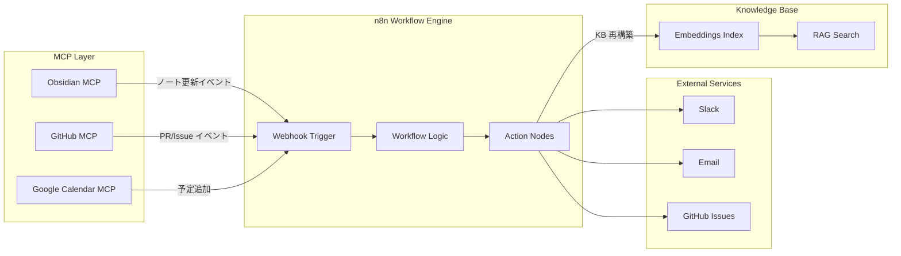
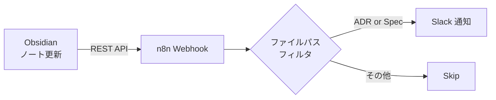
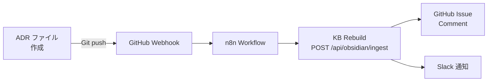
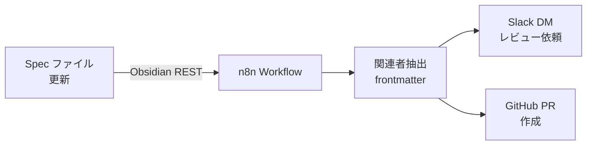
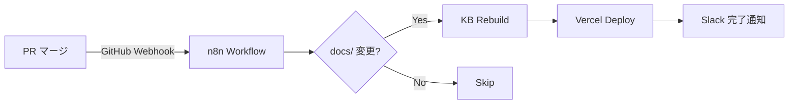
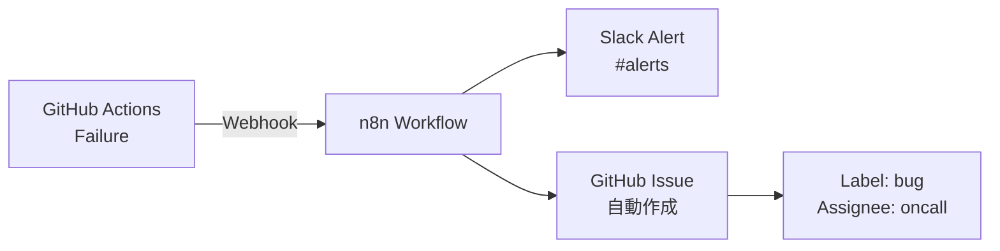
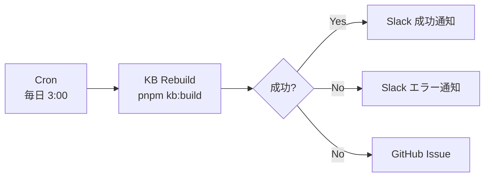

# MCP × n8n 自動化レシピ集

このドキュメントでは、MCP サーバーと n8n ワークフローを組み合わせた典型的な自動化パターン（レシピ）を紹介します。

---

## 📖 概要

### MCP × n8n 自動化とは

**MCP (Model Context Protocol)** と **n8n (Workflow Automation)** を組み合わせることで、以下のような強力な自動化フローを構築できます：

- **Obsidian ノート更新** → Slack/メール通知
- **ADR 作成** → KB 再インデックス → GitHub Issue コメント
- **KB 更新検出** → チーム通知 → ドキュメントレビュー依頼
- **エラー検出** → アラート送信 → 自動復旧試行

### アーキテクチャ概要



---

## 📚 Recipe Catalog（レシピ一覧）

### 🔵 Documentation Workflows（ドキュメント系）

| # | レシピ名 | トリガー | アクション | Phase |
|---|---------|---------|-----------|-------|
| **1** | Obsidian → Slack 通知 | ノート更新 | Slack チャンネル投稿 | 2 |
| **2** | ADR 追加 → KB 再インデックス | ADR ファイル作成 | KB rebuild → GitHub comment | 2 |
| **3** | Spec 更新 → レビュー依頼 | Spec 変更検出 | Slack DM → GitHub PR 作成 | 2 |

### 🟢 Development Workflows（開発系）

| # | レシピ名 | トリガー | アクション | Phase |
|---|---------|---------|-----------|-------|
| **4** | PR マージ → KB 自動更新 | GitHub PR merged | KB ingest → Vercel deploy | 2 |
| **5** | Build 失敗 → アラート | GitHub Actions failure | Slack alert → Issue 自動作成 | 2 |
| **6** | Healthz 異常検出 | `/api/healthz` 503 | PagerDuty alert → 自動再起動 | 3 |

### 🟡 Scheduling Workflows（スケジュール系）

| # | レシピ名 | トリガー | アクション | Phase |
|---|---------|---------|-----------|-------|
| **7** | 定期 KB 再構築 | Cron (毎日 3:00) | KB rebuild → Slack 完了通知 | 2 |
| **8** | 週次レポート生成 | Cron (毎週月曜) | Usage metrics → GitHub Issue | 3 |

---

## 🍳 Detailed Recipes（詳細レシピ）

### Recipe 1: Obsidian ノート更新 → Slack 通知

**用途**: 重要なノート（ADR, Specs）が更新されたときにチームに自動通知

**前提条件**:
- Obsidian Local REST API Plugin 有効
- n8n インスタンス稼働
- Slack Webhook URL 設定済み

**フロー図**:


**n8n ワークフロー設定例**:

```json
{
  "nodes": [
    {
      "type": "n8n-nodes-base.webhook",
      "name": "Obsidian Update Webhook",
      "parameters": {
        "path": "obsidian-update",
        "httpMethod": "POST",
        "responseMode": "onReceived"
      }
    },
    {
      "type": "n8n-nodes-base.filter",
      "name": "Filter ADR/Spec",
      "parameters": {
        "conditions": {
          "string": [
            {
              "value1": "={{ $json.filePath }}",
              "operation": "contains",
              "value2": "ADR-"
            },
            {
              "value1": "={{ $json.filePath }}",
              "operation": "contains",
              "value2": "spec/"
            }
          ],
          "combineOperation": "any"
        }
      }
    },
    {
      "type": "n8n-nodes-base.slack",
      "name": "Slack Notification",
      "parameters": {
        "channel": "#docs-updates",
        "text": "📝 Document updated: {{ $json.filePath }}\nBy: {{ $json.author }}\n{{ $json.summary }}"
      }
    }
  ]
}
```

**トリガースクリプト例** (Obsidian Plugin 側):
```javascript
// Obsidian plugin code (pseudo)
async function onFileModified(file) {
  if (file.path.includes('ADR-') || file.path.includes('spec/')) {
    await fetch('http://localhost:5678/webhook/obsidian-update', {
      method: 'POST',
      headers: { 'Content-Type': 'application/json' },
      body: JSON.stringify({
        filePath: file.path,
        author: file.lastModifiedBy,
        summary: file.excerpt(100),
        timestamp: new Date().toISOString()
      })
    });
  }
}
```

---

### Recipe 2: ADR 追加 → KB 再インデックス → GitHub Comment

**用途**: 新しい ADR が作成されたら、自動で KB に反映し、関連 Issue にコメント

**フロー図**:


**n8n ワークフロー設定例**:

```json
{
  "nodes": [
    {
      "type": "n8n-nodes-base.webhook",
      "name": "GitHub Push Webhook",
      "parameters": {
        "path": "github-push",
        "httpMethod": "POST"
      }
    },
    {
      "type": "n8n-nodes-base.filter",
      "name": "Filter ADR Files",
      "parameters": {
        "conditions": {
          "string": [
            {
              "value1": "={{ $json.commits[0].added.join(',') }}",
              "operation": "contains",
              "value2": "docs/decisions/ADR-"
            }
          ]
        }
      }
    },
    {
      "type": "n8n-nodes-base.httpRequest",
      "name": "Trigger KB Rebuild",
      "parameters": {
        "method": "POST",
        "url": "https://your-app.vercel.app/api/obsidian/ingest",
        "authentication": "headerAuth",
        "options": {
          "timeout": 60000
        }
      }
    },
    {
      "type": "n8n-nodes-base.github",
      "name": "Comment on Related Issue",
      "parameters": {
        "operation": "createIssueComment",
        "issueNumber": "={{ $json.issueNumber }}",
        "body": "📚 ADR updated: {{ $json.adrTitle }}\nKnowledge Base has been rebuilt.\n\nView: [{{ $json.adrPath }}]({{ $json.adrUrl }})"
      }
    },
    {
      "type": "n8n-nodes-base.slack",
      "name": "Slack Notification",
      "parameters": {
        "channel": "#architecture",
        "text": "🏛️ New ADR: {{ $json.adrTitle }}\nKB updated and team notified."
      }
    }
  ]
}
```

---

### Recipe 3: Spec 更新 → レビュー依頼

**用途**: 仕様書が更新されたら、関連する開発者に自動でレビュー依頼

**フロー図**:


**設定例**:
```json
{
  "nodes": [
    {
      "type": "n8n-nodes-base.webhook",
      "name": "Spec Update Webhook",
      "parameters": {
        "path": "spec-update"
      }
    },
    {
      "type": "n8n-nodes-base.code",
      "name": "Parse Frontmatter",
      "parameters": {
        "jsCode": "const frontmatter = $input.item.json.frontmatter;\nconst reviewers = frontmatter.reviewers || [];\nreturn reviewers.map(r => ({ reviewer: r }));"
      }
    },
    {
      "type": "n8n-nodes-base.slack",
      "name": "Send DM to Reviewers",
      "parameters": {
        "channel": "@{{ $json.reviewer }}",
        "text": "📋 Spec review requested: {{ $json.specTitle }}\nPlease review by {{ $json.deadline }}\n{{ $json.specUrl }}"
      }
    }
  ]
}
```

---

### Recipe 4: PR マージ → KB 自動更新

**用途**: ドキュメント変更の PR がマージされたら、自動で KB を再構築して Vercel にデプロイ

**フロー図**:


**設定例**:
```json
{
  "nodes": [
    {
      "type": "n8n-nodes-base.webhook",
      "name": "GitHub PR Merged",
      "parameters": {
        "path": "github-pr-merged",
        "httpMethod": "POST"
      }
    },
    {
      "type": "n8n-nodes-base.filter",
      "name": "Filter Docs Changes",
      "parameters": {
        "conditions": {
          "string": [
            {
              "value1": "={{ $json.pull_request.files }}",
              "operation": "contains",
              "value2": "docs/"
            }
          ]
        }
      }
    },
    {
      "type": "n8n-nodes-base.httpRequest",
      "name": "Trigger KB Rebuild",
      "parameters": {
        "method": "POST",
        "url": "{{ $env.APP_URL }}/api/obsidian/ingest",
        "authentication": "headerAuth"
      }
    },
    {
      "type": "n8n-nodes-base.httpRequest",
      "name": "Trigger Vercel Deploy",
      "parameters": {
        "method": "POST",
        "url": "https://api.vercel.com/v1/deployments",
        "authentication": "headerAuth"
      }
    },
    {
      "type": "n8n-nodes-base.slack",
      "name": "Success Notification",
      "parameters": {
        "channel": "#deployments",
        "text": "✅ Docs updated and deployed\nPR: {{ $json.pr_title }}\nKB rebuilt: {{ $json.kb_chunks }} chunks"
      }
    }
  ]
}
```

---

### Recipe 5: Build 失敗 → アラート + Issue 作成

**用途**: CI/CD パイプラインが失敗したら、Slack でアラートを送り、GitHub Issue を自動作成

**フロー図**:


**設定例**:
```json
{
  "nodes": [
    {
      "type": "n8n-nodes-base.webhook",
      "name": "CI Failure Webhook",
      "parameters": {
        "path": "ci-failure"
      }
    },
    {
      "type": "n8n-nodes-base.slack",
      "name": "Alert Slack",
      "parameters": {
        "channel": "#alerts",
        "text": "🚨 Build failed: {{ $json.workflow_name }}\nCommit: {{ $json.commit_sha }}\nBranch: {{ $json.branch }}\nLogs: {{ $json.logs_url }}"
      }
    },
    {
      "type": "n8n-nodes-base.github",
      "name": "Create Issue",
      "parameters": {
        "operation": "createIssue",
        "title": "CI Failure: {{ $json.workflow_name }}",
        "body": "**Build failed**\n\nCommit: {{ $json.commit_sha }}\nBranch: {{ $json.branch }}\nLogs: {{ $json.logs_url }}\n\nAuto-created by n8n workflow.",
        "labels": ["bug", "ci-failure"],
        "assignees": ["{{ $json.oncall_engineer }}"]
      }
    }
  ]
}
```

---

### Recipe 6: Healthz 異常検出 → 自動復旧

**用途**: `/api/healthz` が 503 を返したら、アラートを送信し、自動再起動を試行

**フロー図**:
```mermaid
flowchart LR
    CRON[Cron Trigger<br/>5分毎] --> HEALTHZ[/api/healthz<br/>チェック]
    HEALTHZ --> CHECK{ok: true?}
    CHECK -->|No| ALERT[PagerDuty Alert]
    CHECK -->|No| RESTART[PM2 Restart<br/>next-app]
    CHECK -->|No| SLACK[Slack 通知]
    CHECK -->|Yes| OK[正常]
```

**設定例**:
```json
{
  "nodes": [
    {
      "type": "n8n-nodes-base.cron",
      "name": "Health Check Cron",
      "parameters": {
        "cronExpression": "*/5 * * * *"
      }
    },
    {
      "type": "n8n-nodes-base.httpRequest",
      "name": "Check Healthz",
      "parameters": {
        "method": "GET",
        "url": "{{ $env.APP_URL }}/api/healthz",
        "options": {
          "timeout": 10000
        }
      }
    },
    {
      "type": "n8n-nodes-base.if",
      "name": "Check OK Status",
      "parameters": {
        "conditions": {
          "boolean": [
            {
              "value1": "={{ $json.ok }}",
              "value2": true
            }
          ]
        }
      }
    },
    {
      "type": "n8n-nodes-base.httpRequest",
      "name": "PagerDuty Alert",
      "parameters": {
        "method": "POST",
        "url": "https://events.pagerduty.com/v2/enqueue",
        "body": {
          "event_action": "trigger",
          "payload": {
            "summary": "Healthz check failed",
            "severity": "critical",
            "source": "n8n-healthz-monitor"
          }
        }
      }
    },
    {
      "type": "n8n-nodes-base.executeCommand",
      "name": "Restart PM2",
      "parameters": {
        "command": "npx pm2 restart next-app"
      }
    }
  ]
}
```

---

### Recipe 7: 定期 KB 再構築

**用途**: 毎日深夜に KB を自動で再構築して、最新のドキュメントを反映

**フロー図**:


**設定例**:
```json
{
  "nodes": [
    {
      "type": "n8n-nodes-base.cron",
      "name": "Daily KB Rebuild",
      "parameters": {
        "cronExpression": "0 3 * * *"
      }
    },
    {
      "type": "n8n-nodes-base.executeCommand",
      "name": "Run KB Build",
      "parameters": {
        "command": "cd /path/to/repo && pnpm kb:build"
      }
    },
    {
      "type": "n8n-nodes-base.if",
      "name": "Check Success",
      "parameters": {
        "conditions": {
          "number": [
            {
              "value1": "={{ $json.exitCode }}",
              "value2": 0
            }
          ]
        }
      }
    },
    {
      "type": "n8n-nodes-base.slack",
      "name": "Success Notification",
      "parameters": {
        "channel": "#kb-updates",
        "text": "✅ Daily KB rebuild completed\nChunks: {{ $json.chunks }}\nDuration: {{ $json.duration }}s"
      }
    },
    {
      "type": "n8n-nodes-base.slack",
      "name": "Error Notification",
      "parameters": {
        "channel": "#alerts",
        "text": "❌ KB rebuild failed\nError: {{ $json.error }}\nLogs: {{ $json.logs }}"
      }
    }
  ]
}
```

---

## 🗺️ Implementation Roadmap

### Phase 2: 基本自動化（Q1 2026）

**優先レシピ**:
- ✅ Recipe 1: Obsidian → Slack 通知
- ✅ Recipe 2: ADR → KB → GitHub Comment
- ✅ Recipe 7: 定期 KB 再構築

**実装タスク**:
1. n8n インスタンス起動（Docker Compose）
2. Webhook エンドポイント設定
3. Slack / GitHub 認証設定
4. 基本ワークフロー作成＆テスト

### Phase 3: 高度な自動化（Q2 2026）

**追加レシピ**:
- ✅ Recipe 4: PR マージ → KB 自動更新
- ✅ Recipe 5: Build 失敗 → アラート
- ✅ Recipe 6: Healthz 異常検出 → 自動復旧

**実装タスク**:
1. PagerDuty 統合
2. PM2 リモート操作
3. エラーリカバリーロジック
4. モニタリングダッシュボード

### Phase 4: エンタープライズ拡張（Q3 2026）

**拡張機能**:
- カスタムレシピ作成UI
- ワークフロー versioning
- A/B テスト自動化
- メトリクス収集＆分析

---

## 🔗 Integration Points（統合ポイント）

### 既存システムとの接続

**1. Obsidian MCP**
- **接続方法**: REST API (Layer 1) または MCP (Layer 2)
- **用途**: ノート更新検出、コンテンツ取得
- **参照**: [MCP-Obsidian 統合仕様](./mcp-obsidian-spec.md)

**2. GitHub MCP**
- **接続方法**: GitHub Webhooks + MCP API
- **用途**: PR/Issue イベント処理
- **参照**: [MCP Setup Guide](./mcp-setup-guide.md)

**3. Knowledge Base**
- **接続方法**: `/api/obsidian/ingest` (POST)
- **用途**: Delta 更新、全体再構築
- **参照**: [KB Setup Guide](./kb-setup.md)

**4. Vercel Deployment**
- **接続方法**: Vercel API + Deployment Protection Bypass
- **用途**: 自動デプロイトリガー
- **参照**: [Deploy & Smoke Guide](./deploy-and-smoke.md)

---

## 🛠️ Development Setup

### ローカル n8n 起動

```bash
# Docker Compose で起動
docker compose up -d n8n

# または PM2 で起動
npx pm2 start services/ecosystem.config.cjs --only n8n

# アクセス
open http://localhost:5678
```

### Webhook テスト

```bash
# n8n Webhook にテストリクエスト送信
curl -X POST http://localhost:5678/webhook/obsidian-update \
  -H "Content-Type: application/json" \
  -d '{
    "filePath": "docs/decisions/ADR-0006-test.md",
    "author": "Test User",
    "summary": "Test ADR for workflow validation",
    "timestamp": "2025-11-17T12:00:00Z"
  }'
```

---

## 📚 関連ドキュメント

- [MCP Setup Guide](./mcp-setup-guide.md) - MCP サーバー初期設定
- [MCP Local Dev Guide](./mcp-local-dev.md) - MCP ローカル開発
- [KB Setup Guide](./kb-setup.md) - Knowledge Base 構築
- [Getting Started](./getting-started.md) - 開発者向けオンボーディング
- [ADR Index](../decisions/index.md) - ADR 一覧と関係図

---

## 📞 フィードバック・質問

レシピの追加や改善案があれば、[GitHub Issues](https://github.com/dauberside/dauberside.github.io/issues) でお知らせください。

---

**自動化で開発体験を最高に 🚀**

**最終更新**: 2025-11-17
